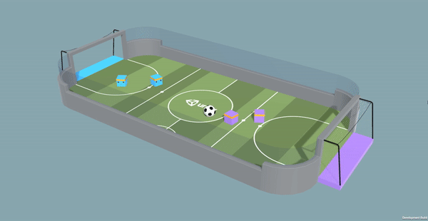

# RLSoccerTwo

Il s'agit d'un projet de session pour le cours IFT-608 (planification en intelligence artificielle), sous la supervision de Mohamed Mehdi Najjar. Nous avons implémenté les algorithmes de MARL MA-DDPG et Q-Mix.



## Installation

L'installation la plus simple pour lancer un entraînement est détaillé dans `Install.md`.

## Utilisation

### Démarrage rapide

Depuis la racine du projet, exécutez la commande :

```bash
python trainers/maddpg/main.py
```

### Configuration

Dans le dossier `trainers/configs`, vous trouverez des **fichiers de configuration** par défault pour les entraînements. Ces fichiers ont étés commentés au mieux pour faciliter la personalisation. Pour faire office de démo, ces configurations charge **par défaut un modèle préentraîné**.

Si vous décider d'utiliser un nouveau fichier de configuration, vous devrez mettre à jours la vriable `CONFIG_PATH` dans le fichier `main.py` du modèle choisit.

### Lancer un modèle

Les scripts d'entrînement et d'inférence sont situés dans le dossier `trainers`.

Pour lancer un modèle, il suffit de lancer le fichier `main.py` depuis la racine du répertoire, pensez à **activer l'environnement python** préalablement installé.
Par exemple pour MA-DDPG :

```bash
python trainers/maddpg/main.py
```

Après quelques logs d'initialisation, la fenêtre de l'environnement devrait s'ouvrir et l'environnement devrait commencer. Le model et ses statistiques seront sauvegardés dans le répertoire models/`model_name`/`run_id`, (model_name étant le nom choisit dans la configuration).

### Statistiques d'entraînement

Le package **tensorboard** est utilisé pour visualiser les statistiques d'entraînement. Les statistiques sont enregistrés dans le répèrtoire models/`model_name`/`run id`/logs. Pour lancer tensorboard, il suffit de lancer la commande suivante :

```bash
tensorboard --logdir <models/model_name/run_id/logs>
```
